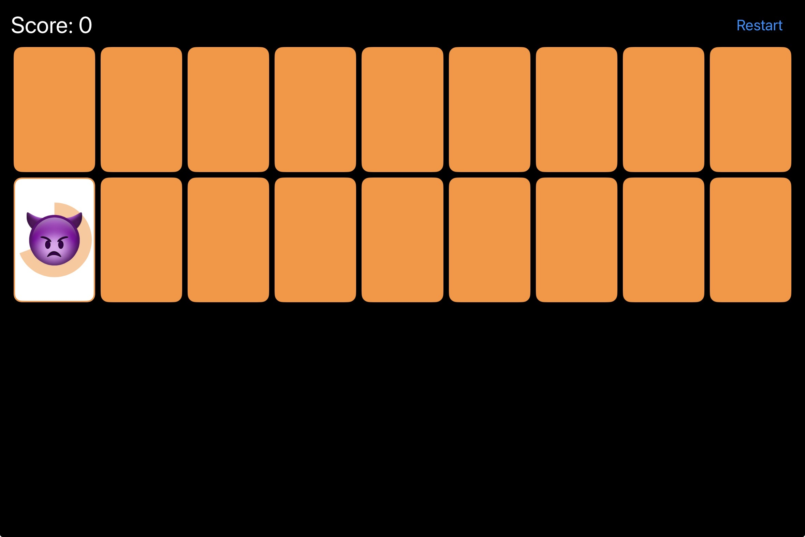

# Memorize

A memory card matching game built with SwiftUI as part of Stanford's CS193p course.

## About

Memorize is a classic memory game where players flip cards to find matching pairs. The game features:

- **Card Matching**: Find pairs of emoji cards by flipping them over
- **Scoring System**: Earn points for matches and bonus points for quick matches
- **Animated Gameplay**: Smooth card flip animations and dealing effects
- **Restart Functionality**: Start a new game anytime with the restart button

## Features

- Clean SwiftUI interface
- Animated card dealing from deck
- Real-time score tracking with bonus scoring
- Responsive grid layout that adapts to screen size
- Halloween-themed emoji cards

## Course

This project was developed following Stanford University's CS193p (Developing Applications for iOS using SwiftUI) course, demonstrating key SwiftUI concepts including:

- MVVM Architecture
- State Management with @ObservedObject
- Custom Views and ViewModifiers
- Animations and Transitions
- GeometryReader and AspectRatio